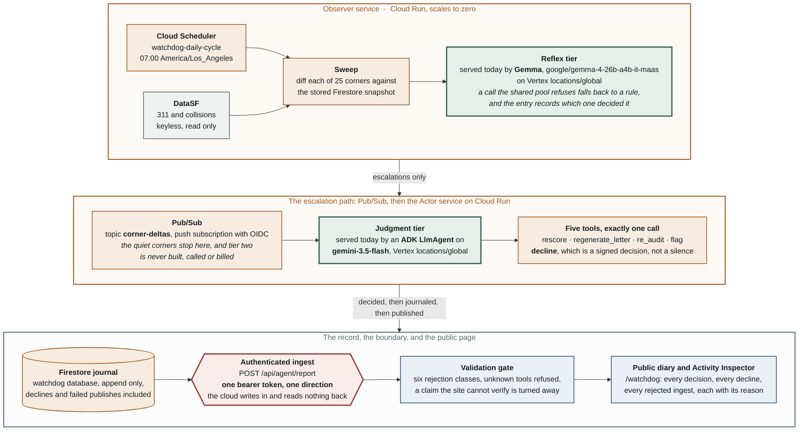

# The Corner Watchdog

An autonomous agent that reads San Francisco's street data every morning, compares it to
what it saw yesterday, and decides on its own whether anything changed enough to act on.
Most mornings it decides to do nothing. It publishes those mornings too, with the
reasoning attached.

I moved to the Bay Area and ended up spending a lot of time thinking about the
intersections I walk through. This is what came of that: a machine that watches the
twenty five worst corners in the city, on its own schedule, and tells you what it decided
not to do.

**The ledger: [`docs/ledger.html`](docs/ledger.html)** &middot;
**[Architecture](docs/architecture.md)** &middot;
**[Patterns](docs/PATTERNS.md)** &middot;
**[Decisions and rejections](DECISIONS.md)** &middot;
**[What went wrong](LOG.md)**

---

## Disclosure

Read this before the rest.

- **StreetCred, the display surface this agent publishes to, predates this hackathon.**
  It was built at a prior Build Club event. The Corner Watchdog, meaning this repository
  and every line in it, is entirely new work built for All Things Agentic.
- **All of the Google Cloud integration is now wired, and this bullet used to say the
  opposite.** Until 2026-08-26 it read: none of it is wired, not Vertex, not Gemini, not
  Gemma, not Firestore, not Pub/Sub, not Cloud Run, and no Google Cloud account has been
  created, authenticated to, or touched at any point in this project. That was true when
  it was written and every clause of it is now false. Two Cloud Run services, a Firestore
  database, a Pub/Sub topic with an OIDC push subscription, Secret Manager, Cloud
  Scheduler, and both model tiers on Vertex. The inventory is in
  [`HANDOFF.md`](HANDOFF.md) and the shape is in
  [`docs/architecture.md`](docs/architecture.md). The old wording is quoted rather than
  deleted because a disclosure that silently improves is not a disclosure.
- **Both tiers are Google models, as of 2026-08-26.** The Agent Development Kit is now
  genuinely in use and tier two is an `LlmAgent` with five registered tools in
  `src/corner_watchdog/adk_decider.py`, on `gemini-3.5-flash`. Tier one is Gemma, `google/gemma-4-26b-a4b-it-maas`, on Vertex at
  `locations/global`, reached through the same Application Default Credentials as tier
  two with no second key and no new secret. Tier one was a deterministic stand-in for the
  whole build until this date, and every entry it wrote said so.
  **The stand-in has not been deleted and it still runs.** Gemma reaches Vertex through a
  shared managed pool that refuses roughly one call in three with a queue-full 429. Those
  are retried three times and then a rule answers instead, so a single sweep can produce
  entries from both. Which one decided is recorded on the entry, in `tier1.decidedBy`, not
  inferred from how the run was configured, because a corner nobody looked at and a corner
  judged unimportant are the same shape in a journal unless something says otherwise.
- **The agent now publishes its decisions, and only its decisions.** Every journaled
  decision is posted to one authenticated endpoint on StreetCred,
  `POST /api/agent/report`, in one direction only: StreetCred never calls the agent. The
  site validates every field before publishing any of it and refuses an unresolvable
  corner, a date in the future, a decline with no reasoning, a tool outside the known set,
  a consequence it cannot verify from its own records, and a decision it already holds.
  Refusals are published too, at
  [`/watchdog`](https://streetcred.thealexschroeder.workers.dev/watchdog). This is a change
  from every earlier version of this page, which said the agent had never posted anything
  anywhere; that was true until 2026-08-26 and `tools/check.sh` fails the build if this
  page and `runner.py` ever disagree about it again.
- **The actuator still posts nothing.** Publishing a decision is not the same as acting on
  the world. The live path exists, implements the interface, and refuses on every verb, so
  no letter this agent drafts has been sent to anyone.
- **Nothing in this repo has ever observed a real change at a watched corner.** The city
  was quiet for the whole build. Every number below reflects that.

## What it does

- **Watches 25 corners** taken from StreetCred's public scoreboard, pinned so the roster
  cannot drift silently, and journals a corner the moment it stops watching it.
- **Reads the city's own record**, 5,905 collision and street-condition records across the
  watched set, in 125 unauthenticated queries per sweep.
- **Diffs against yesterday** with a deterministic engine that refuses to compare a partial
  fetch, a corrupted baseline, or two readings taken under different queries.
- **Routes by cost.** A cheap tier sees every change; an expensive tier only ever sees what
  the cheap one escalated. Deaths and severe injuries never reach either: they escalate by
  rule, before any model is consulted. Both tiers are Google models: Gemma on the cheap
  one, Gemini on the expensive one.
- **Runs as a two-agent graph.** A `SequentialAgent` over a custom triage agent and an
  `LlmAgent` with five registered tools, with the edge between them conditional so the
  expensive tier is skipped rather than entered and excused. What each callback enforces and
  why the edge is built the way it is are in [`docs/architecture.md`](docs/architecture.md).
- **Cannot end a deliberation in silence.** The judgment agent must call exactly one tool,
  and `decline` is one of them. Zero calls is an error and two is an error, and neither is
  counted as restraint.
- **Acts into a local outbox** in dry run, rendering the actual letter with the corner's
  actual figures rather than a log line saying a letter would have been written.
- **Publishes every decision**, including and especially the ones that ended in nothing,
  with the reasoning verbatim and a link to the raw journal record.
- **Says which tier decided, per entry.** Every entry carries `tier1.decidedBy`: Gemma,
  the rule that stood in when Gemma's shared pool refused the call, or the deterministic
  floor that settled it before either tier was consulted. Recorded rather than inferred
  from the run's configuration, because one sweep produces all three. The older
  `degraded` line is still there for run-level admissions, and the ledger prints how many
  entries carry it rather than claiming all of them do: the journal is append only, so
  entries written before a field existed cannot gain it.

## The shape of one cycle

Eleven boxes, and every one of them is running. The two tiers are labelled with what
serves each **today** rather than what is planned for it, because a diagram that draws
the intended system next to the built one is how a reader ends up believing the intended
one shipped.



Rendered at [`docs/architecture.png`](docs/architecture.png), source in
[`docs/architecture.mmd`](docs/architecture.mmd), and the callbacks, the conditional edge
and the reasons for each are in [`docs/architecture.md`](docs/architecture.md).

Three things in that picture are worth saying in prose.

**The arrow out of the observer says `escalations only`, and that is the architecture.**
A `SequentialAgent` runs its sub-agents unconditionally, so the obvious build lets tier
two start and return early on a quiet corner. That version writes the same journal and
bills a model on every corner every morning. The gate is a `before_agent_callback` on
tier two, checked before the agent is entered at all, so a quiet corner costs nothing
rather than costing a little.

**The boundary is one token in one direction.** The cloud side posts to
`/api/agent/report` with a bearer token out of Secret Manager and reads nothing back. The
public site holds no credential for the agent, cannot call it, and cannot be used to
reach it.

**The gate is on the far side of that boundary, not this one.** StreetCred validates what
arrives on content rather than trusting the sender, which is why the first real cloud
deliberation was refused: the agent claimed it had redrafted a letter, and the site holds
no letter for that corner. That refusal is on the public page with its reason, and it is
the gate working rather than a bug.

## The numbers

All measured from this repository on 2026-08-20, except the last row, which is a fact about the world and is current. The journal figures describe the local state directory; the deployed agent keeps its own journal in Firestore, which is larger.

| | |
| --- | --- |
| Agents | 2, an observer and an actor, separated by a bus |
| Cognition tiers | 2, plus a deterministic rule floor beneath both |
| Corners watched | 25 |
| City records covered per sweep | 5,905 (1,136 collision, 4,769 street-condition) |
| Fatalities in the watched set's five year record | 12 |
| Severe injuries in the same record | 129 |
| DataSF queries per sweep | 125, unauthenticated |
| Evaluations journaled | 175 |
| Actions taken | 0 |
| Restraint rate | 100 percent, and the ledger explains why that number is not yet impressive |
| Tests | 678, offline, no credentials, 14 seconds, 12 of which is one lock-release test waiting on a real timeout |
| Runtime dependencies | 2 (`httpx`, `google-adk`) |
| Google Cloud accounts touched | 1, `streetcred-506117`. This row read 0 until 2026-08-25 |

The restraint rate is 100 percent and the ledger says, on its own front page, what that is
made of: 171 of the 175 declines were settled by a rule rather than weighed by a tier, so
the number still mostly measures a quiet city rather than a careful agent. The other four
are the first real ones. On the sweep at 16:01 on 2026-08-20 the city's 311 counts moved at
four watched corners, tier one weighed each and declined as ordinary variance. A number
that flatters the system is worth less than one that explains itself.

## Quick start

Verified from a clean clone into a fresh virtual environment on 2026-08-26: 63 packages
installed including pip itself and the project, three of them Google (`google-adk`, and
`google-genai` and `google-auth` beneath it). With the cloud extra added on top,
all 678 tests green with no network and no credentials.

That count was 15, and none of them were Google, until tier two became an ADK agent. The
jump is what adopting a framework actually costs, and it is stated here rather than
absorbed quietly, because the previous number was used on this page as evidence that the
project had kept its dependencies honest.

```bash
git clone https://github.com/alejandro-publius/streetcred-watchdog
cd streetcred-watchdog

# 3.11 or newer. Plain `python3` is 3.9 on a stock macOS and the failure it gives
# is a confusing one about google-adk having no matching distribution.
python3.11 -m venv .venv && source .venv/bin/activate
pip install -e ".[dev]"          # two runtime dependencies: httpx and google-adk

pytest -q                        # 652 pass, no network, no credentials
# 27 more need the Google client libraries and skip without them, by design:
# pip install -e ".[dev,cloud]"  then pytest -q reports the full 678
python -m corner_watchdog run --cycles 2  # the whole loop, twice, against live DataSF
open docs/ledger.html            # every decision, restraint rate on top
```

Two cycles minutes apart will correctly find that nothing changed, which means the
expensive half of the loop never runs. To exercise it:

```bash
python -m corner_watchdog rehearse      # constructed baselines, kept out of the real journal
python -m corner_watchdog doctor        # 20 checks: environment, sources, vocabulary, stored state
python -m corner_watchdog schedule      # renders launchd and cron config, installs nothing
python -m corner_watchdog ledger --corner 6th-and-mission
```

## Running it on Google Cloud

Deployed and proven on 2026-08-25: two Cloud Run services, Firestore, Pub/Sub,
Secret Manager, Cloud Scheduler, and Gemini 3.5 Flash on Vertex AI at
`locations/global`. Resource names, URLs and a teardown command are in
[`HANDOFF.md`](HANDOFF.md); the reasoning behind each step, including what every
API is for and what it costs, is in
[`docs/GCP_PRECONDITIONS.md`](docs/GCP_PRECONDITIONS.md).

```bash
gcloud auth login && gcloud config set project YOUR_PROJECT
./scripts/preflight_gcp.sh              # read only, mutates nothing, names what is missing

# A budget before any API, because an alerts-only budget does not cap spend and
# you want to know that before you find out.
gcloud billing budgets create --billing-account=YOUR_BILLING_ID \
  --display-name="watchdog total" --budget-amount=450USD \
  --threshold-rule=percent=0.25 --threshold-rule=percent=0.50 --threshold-rule=percent=0.90 \
  --filter-projects=projects/YOUR_PROJECT_NUMBER

gcloud services enable run.googleapis.com firestore.googleapis.com pubsub.googleapis.com \
  cloudscheduler.googleapis.com secretmanager.googleapis.com aiplatform.googleapis.com \
  artifactregistry.googleapis.com cloudbuild.googleapis.com

# Named, not (default). The client library double-encodes the parentheses and
# every call against the default database is rejected. See HANDOFF.md.
gcloud firestore databases create --database=watchdog --location=us-central1

# Service accounts, secret, topic: docs/GCP_PRECONDITIONS.md steps 5 to 7 verbatim.

gcloud run deploy watchdog-observer --source . --region=us-central1 \
  --service-account=watchdog-observer@YOUR_PROJECT.iam.gserviceaccount.com \
  --no-allow-unauthenticated --min-instances=0 --max-instances=3 \
  --set-env-vars=SERVICE=observer,GOOGLE_CLOUD_LOCATION=global,GOOGLE_GENAI_USE_VERTEXAI=true,DECIDER=adk,FIRESTORE_DATABASE=watchdog,DAILY_ACTION_BUDGET=40,DAILY_TOKEN_BUDGET=200000

# The actor is the same command with SERVICE=actor, its own service account, and
# --set-secrets=WATCHDOG_INGEST_TOKEN=WATCHDOG_INGEST_TOKEN:latest

./scripts/preflight_gcp.sh              # every row should now pass
```

Read the service URL from `gcloud run services describe`, not from what
`gcloud run deploy` prints. They are different, and only one of them serves.

Prove it end to end:

```bash
URL=$(gcloud run services describe watchdog-observer --region=us-central1 --format='value(status.url)')
curl -s -X POST -H "Authorization: Bearer $(gcloud auth print-identity-token)" $URL/status
curl -s -X POST -H "Authorization: Bearer $(gcloud auth print-identity-token)" $URL/sweep
```

The first sweep against an empty Firestore records 25 first sightings and
escalates nothing, which is correct: there is nothing to compare against yet.
The second sweep is the one that can produce a delta.

## Patterns

Named in the vocabulary the Agent Development Kit uses, with an honest column for whether
they are built. Six of them are written up at length, each with the test that fails if the
claim stops being true, in [`docs/PATTERNS.md`](docs/PATTERNS.md).

| Pattern | How it appears here | Status |
| --- | --- | --- |
| Event-driven fan-out | The observer publishes escalations to a bus; the actor subscribes and never reads the observer's state. Locally the bus is an in-process call that round-trips through JSON, so a payload Pub/Sub could not carry fails here rather than in production. | built |
| Cost-routed cascade | A deterministic floor answers most deltas for free, Gemma takes the ambiguous middle, and Gemini only ever sees escalations. Across 175 real evaluations, the number that would have reached tier two is four. | built |
| Human-in-the-loop | `flag` is a first-class action, mandatory alongside any redraft on a new fatality. The live path additionally refuses to send until a human has read a full dry-run outbox and agreed with every letter in it. | built as a gate |
| Decline queue | Declines are journaled by the observer at the moment they are made, never routed through the expensive tier, and rendered at the same visual weight as actions. | built |
| Review and critique verifier | StreetCred recomputes every figure in an agent-written letter from the corner's own record and stores its own answer, recording disagreement as `selfReportDisputed`. The agent does not get to mark its own homework. | planned, not deployed |
| Bounded self-calibration | Thresholds move from logged outcomes inside hard floors and ceilings, with every adjustment journaled with its before and after. This is threshold nudging, not model retraining, and the public page says exactly that. | schema and bounds built, nothing adjusts them yet |

## Why the declines are the product

An agent that only publishes its actions is showing you a highlight reel. Anyone can build
something that fires on every change. The hard part, and the part that makes an agent
trustworthy enough to leave unsupervised, is the deciding not to.

So the restraint rate is the headline number, every decline is a first-class entry with its
reasoning attached, and the page breaks that number down into what was actually weighed
versus what a rule merely observed, because those are different events and adding them
together produces a number that describes a quiet city while reading as a careful agent.

## What went wrong

**A filter that matched nothing, for the entire life of the project.**

`SEVERE_VALUES` held `("Severe Injury", "Suspected Serious Injury")` from the first commit.
Those are CHP's category names. DataSF publishes `Injury (Severe)`. The query was valid
SoQL, matched zero rows, and returned a clean zero for every corner on every sweep, which
made the rule "any new severe injury is significant" a rule that could never fire.

Nothing failed. Nothing could fail. A filter matching nothing is indistinguishable from a
corner where nothing happened. It was found by running the loop against live data and
noticing that all 25 corners reported zero severe injuries while StreetCred's own board
showed 9 at one of them.

Two things came out of it that are worth more than the fix. Every enumerated value the code
puts in a WHERE clause is now pinned against the live vocabulary with the row count carried
alongside, and a cycle refuses to start if they disagree. And the same class of bug turned
up twice more once I knew to look: a `count(*)` alias rename parsing as zero, and a tie in
the district group-by resolving to whatever order the API returned, so a tied corner would
flip district between sweeps and journal it as a real change.

**Then fixing a different bug nearly caused the exact failure this repo exists to prevent.**
Measuring against StreetCred's published figures showed the radius should be 80 metres, not
150. Changing it would have made the next sweep subtract 80 metre counts from 150 metre
counts and report a 40 percent collapse in collisions at all 25 corners on the same
morning, with confident reasoning attached. Snapshots now carry a fingerprint of the query
that produced them and the delta engine refuses to subtract across a change in it. The
cycle after the change journaled 25 refusals naming both fingerprints and took no action.

Full evidence in [`LOG.md`](LOG.md).

## Requirements coverage

Every row was **no** or **locally** until the week of 2026-08-25. The old table is
worth remembering, because it is the version a judge would have read: it said Gemini
was not wired, Google Cloud was five local stand-ins, and the additional model was a
rule. All of that was true when written.

| Criterion | Where it lives | Wired |
| --- | --- | --- |
| Gemini 3 or newer via Vertex AI | `adk_decider.py`, `gemini-3.5-flash`, `locations/global` | yes, deployed |
| Agent Development Kit | `adk_decider.py`, an `LlmAgent` with five tools; `adk_graph.py`, a `SequentialAgent` | yes |
| Google Cloud services | two Cloud Run services, Firestore, Pub/Sub, Secret Manager, Cloud Scheduler | yes, inventory in [`HANDOFF.md`](HANDOFF.md) |
| Additional Google model | `brains.GemmaTriage`, `google/gemma-4-26b-a4b-it-maas` on Vertex | yes, and a rule answers when its shared pool refuses |
| Autonomous operation | Cloud Scheduler `watchdog-daily-cycle`, 07:00 Pacific, ENABLED | yes, and it has fired on its own |
| Persistent memory | Firestore `watchdog`, append only; `store.py` locally | yes, deployed |
| Observability | `/watchdog` on StreetCred, `ledger.py`, `docs/ledger.html` | yes |
| Safety and restraint | `delta.py` rule floor, `live.py` refusal, `budget.py` intents | yes |

One thing on that list is narrower than it reads. **Autonomous operation has fired on
its own schedule, and every sweep so far found a quiet city**, so the deterministic
floor settled all 25 corners and neither model tier was consulted. That is the cost
routing working exactly as designed, and it also means no scheduled run has yet
produced an entry a model decided. `tier1.decidedBy` on each entry is what will show
it on the first morning something changes.

## Considered and rejected

Fuller versions in [`DECISIONS.md`](DECISIONS.md).

- **Calling a small local model so the demo could say a model ran.** Buys a sentence in a
  pitch, costs the one property this project is about.
- **Mutating real snapshots to force an interesting delta for the demo.** The rehearsal
  constructs the *past* instead, never the present, and every entry it writes says so.
- **A hash for the query fingerprint.** The journal entry that refuses a comparison prints
  it, and `r=80m;collisions=5y;...` tells a reader what happened where `a3f19c` does
  not. No entry ever printed `r=150m`: the old baselines predated the field, so the
  refusals read `not recorded then r=80m...`, which is itself the right answer.
- **Coercing a corrupted stored count to zero.** That is the SEVERE_VALUES failure with a
  different mask. It refuses to load and the file is quarantined instead.
- **Leaving the live path unwritten, or callable behind a flag.** Unwritten hides whether
  the interface fits until the worst moment; callable is how a dry run becomes a live send
  by way of one wrong argument.
- **Quoting Vertex prices from memory in the cost estimate.** Token counts are measured;
  the rates are left blank with the arithmetic beside them.

## Repository map

| Path | What it holds |
| --- | --- |
| `src/corner_watchdog/ports.py` | Every cloud dependency, named as a protocol. The seams. |
| `src/corner_watchdog/delta.py` | `diff_snapshots` and the rule floor. Deterministic, no model, no network. |
| `src/corner_watchdog/datasf.py` | DataSF reads, and the constants that were wrong for a fortnight. |
| `src/corner_watchdog/vocabulary.py` | Guards on every enumerated value that goes into a query. |
| `src/corner_watchdog/observer.py` | The sweep: look, compare, triage, escalate or decline. |
| `src/corner_watchdog/actor.py` | Deliberate on what was escalated, then act or decline. |
| `src/corner_watchdog/contract.py` | The decision schema both tiers must answer in, with a validator. |
| `src/prompts/` | Both prompts in full, with ten worked examples the test suite parses. |
| `src/corner_watchdog/live.py` | The live path. Implements the interface, refuses every verb. |
| `src/corner_watchdog/ledger.py` | The journal as a page, restraint rate on top, declines at full size. |
| `tests/` | 678 of them. The cases where a naive implementation produces a confident lie. |
| `LOG.md`, `DECISIONS.md` | What was found by running it, and what was decided and rejected. |

## A note on the radius

This repo used 150 metres until 2026-08-20, on the strength of reading StreetCred's source
rather than measuring its output. That was wrong.

Querying DataSF at **80 metres over five years** reproduces StreetCred's published
scoreboard counts exactly, in all four severity categories, for six of six corners probed.
Across the whole watched set, 80 metres agrees with StreetCred on fatalities at 25 of 25
corners, severe injuries at 24 of 25, and total injury collisions at 23 of 25.

Two corners still disagree. `gough-and-haight` matches at roughly 90 metres rather than 80,
so StreetCred's corner geometry is not a uniform circle and the exact rule is not known.
The 311 window could not be pinned at all. The agent keeps its own three year window and
says so in every letter, so the two figures are openly different quantities rather than two
claims about the same thing that disagree.
