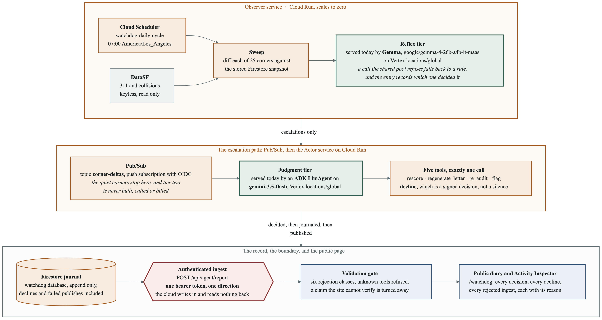

# Architecture



Eleven boxes, and every one of them is running. Both tiers are labelled with what serves
each **today** rather than what is planned for it. Source in
[`architecture.mmd`](architecture.mmd), and the same diagram is inline in both READMEs.
Regenerate both renders with:

```bash
npx @mermaid-js/mermaid-cli -i docs/architecture.mmd -o docs/architecture.png -w 1920 -H 1080 -b white -s 2
npx @mermaid-js/mermaid-cli -i docs/architecture.mmd -o docs/architecture.svg -b transparent
```

The PNG is 3480 by 1826, which is a shade under 16 by 9 and drops into a 1080p frame with
room for a title. One layout note worth writing down, because it cost two renders to
find: mermaid silently discards a subgraph's own `direction` the moment an edge from
outside reaches past it to one of its children. Every external edge here therefore
attaches to a subgraph id, never to an inner node, which is why the lanes lay out as rows
instead of collapsing into one very long line.

## The agent graph

This is the part that changed. Tier two is an Agent Development Kit `LlmAgent`
and the two tiers are now a `SequentialAgent`, so the cost-routed cascade is a
graph rather than a call sequence.

**On a deprecation, stated here rather than left in a warning.** `SequentialAgent`
is deprecated in `google-adk` 2.7.1, the version pinned here, in favour of
`Workflow` in `google.adk.workflow`, and it emits a `DeprecationWarning` on every
run of the test suite. This repository still uses `SequentialAgent`, deliberately:
the ADK's own deprecation note says a `Workflow` cannot yet be used as an
`LlmAgent` sub-agent, which is precisely the shape this graph needs. It is a
known migration, not an oversight, and it is written down here because a judge
reading the test output will see the warning and deserves to find the reason in a
document rather than in a source comment.

```
SequentialAgent "corner_watchdog"
  |
  +-- GemmaTriageAgent            a custom BaseAgent wrapping the triage path
  |     |                         unchanged: delta.py's rule floor first, then
  |     |                         the Triage implementation, in that order
  |     |
  |     +-- did not escalate ---> tier two is skipped, not entered and excused
  |
  +-- corner_watchdog_decider     LlmAgent, five registered tools
        |
        +-- rescore              \
        +-- regenerate_letter     |  four actions, each requiring the published
        +-- re_audit              |  claim it corrects to be named first
        +-- flag                 /
        +-- decline                 doing nothing, signed and journaled
```

The agent must call exactly one of those five. That is the design claim of the
project expressed as code: doing nothing is not silence, it is a decision with
reasoning attached, landing in the journal in the same shape as an action. Zero
tool calls is an error and two is an error, and neither is counted as restraint.
See [`adk_decider.py`](../src/corner_watchdog/adk_decider.py).

The edge between the two agents is conditional and it is the expensive one. It is
a `before_agent_callback` on tier two rather than `end_invocation` on tier one,
because every sub-agent runs against its own copy of the invocation context: a
triage agent ending its own invocation does not stop the sequence, and the
version that gets this wrong produces an identical journal while billing a model
on every quiet corner. Across the 175 evaluations in the real journal, four would
have reached tier two.

Three guardrails run inside the invocation rather than around it, as ADK
callbacks, so the `adk web` console, the eval set and the production sweep cannot
be run without them:

| Callback | What it does |
| --- | --- |
| `before_model` | The daily action budget. No budget, no model call, and the entry says the deliberation did not happen. |
| `before_model` | The prompt-injection screen on text that arrived from a public API. Not sanitised, not silently declined, journaled with the matched phrase quoted. |
| `after_tool` | The journal write, at the moment the decision is signed. |

Run it locally with `adk web agents`. The graph is exposed for the ADK's tooling
in [`agents/corner_watchdog_graph/agent.py`](../agents/corner_watchdog_graph/agent.py),
which builds the same graph production runs rather than one shaped for a demo.

## What the diagram used to say, and why that changed

Until 2026-08-26 this page carried a two-layer diagram: a dashed green band of things
that ran on a laptop, and an amber band captioned as an inventory of what each stand-in
stood in for, wired to nothing. It said, in full: no Google Cloud account was created,
authenticated to, or touched at any point in this project.

That was true when it was written and it is not true now. Both bands are one connected
system, deployed, and the honest thing to do with a diagram that has been overtaken is to
replace it and say so rather than let a reader find the old one behind a link. The
[deployment inventory](../HANDOFF.md) lists what exists.

Both tiers are now models, which was not true when this diagram was redrawn earlier the
same day. Tier one is Gemma, `google/gemma-4-26b-a4b-it-maas`, on Vertex at
`locations/global`. The deterministic tier is still in the build and still runs: Gemma's
managed pool refuses roughly one call in three with a queue-full 429, and after three
retries a rule answers instead. Which of the two produced a verdict is recorded on the
entry as `tier1.decidedBy` rather than in a run-level note, because a run-level note is
identical on both and therefore true of neither.

The rule floor is neither a tier nor a model. `delta.py` is deterministic arithmetic with
no model, no network and no cloud in it, and it is the piece that decides anything
expensive to get wrong. A new fatality escalates by rule, before either tier is consulted,
so no model can be talked out of it. It sits inside the sweep box.

## What each component is for

| Rubric job | What serves it today | Where |
| --- | --- | --- |
| Timed trigger | Cloud Scheduler, `watchdog-daily-cycle`, 07:00 Pacific | deployed |
| Scale-to-zero runtime | two Cloud Run services, `SERVICE` picks the half at boot | deployed |
| Cost-routed triage | `GemmaTriageAgent` wrapping `GemmaTriage` | deployed, Gemma on Vertex, falling back to a rule per call |
| Decoupled trigger | Pub/Sub topic `corner-deltas`, push subscription with OIDC | deployed |
| Agent framework | `SequentialAgent` over two agents, five registered tools | deployed |
| Deliberation with reasoning traces | `AdkDecider`, an `LlmAgent` on `gemini-3.5-flash` | deployed, Vertex `locations/global` |
| Persistent cross-session memory | Firestore, named database `watchdog`, append only | deployed |
| Zero credentials in code | Secret Manager, scoped accessor on both services | deployed |
| The one trust boundary | `POST /api/agent/report`, one bearer token, one direction | deployed |
| Public observability | `/watchdog` on StreetCred, plus `docs/ledger.html` | deployed |

`LocalJsonStore`, `DirectBus` and `DryRunActuator` did not go away. They are what a local
run still uses, which is what keeps the test suite offline and credential free, and the
seam between them and the cloud implementations is the same one it always was.

Five of those rows are protocols in [`ports.py`](../src/corner_watchdog/ports.py):
`Store`, `Bus`, `Triage`, `Decider` and `Actuator`. Each now has two
implementations, the local one and the cloud one, and nothing above the seam knows which
side it was handed. The other four rows are not protocols and should not be read as
though they were: the trigger, the runtime, the secret store and the public page are
infrastructure, not interfaces.

Swapping a protocol is a constructor change at one of two wiring sites,
`select_brains()` in `brains.py` for the two tiers and `run_cycle()` in
`runner.py` for the rest. That plan was [`GEMINI_WIRING.md`](GEMINI_WIRING.md); it has
since been carried out, and the file is kept as the record of what was intended before
the deployment found out what was actually hard.

`Decider` is the one that now has two real implementations rather than one.
`DECIDER=adk` is the default and `DECIDER=rule` keeps the deterministic stand-in
selectable, so the two can be compared on the same journal rather than by
argument. The actor cannot tell which one it was handed, which is what makes the
comparison worth anything.

## The one thing the diagram cannot show

Every journal entry now carries a `degraded` line naming which tier was not a
model. That is the load-bearing detail of the whole design: an agent that falls
back quietly produces output indistinguishable from one that did not, so the
fallback says so in the record rather than in a footnote.

It was not always true. The full account of how the claim was false, and of the
audit that counted, is in `LOG.md` under the burn pass. The short version is that
the journal is append only, so the entries written before the field existed cannot
gain it, and the ledger prints how many carry the line instead of rounding up.

## Reading the diagram

Three things in that picture are worth saying in prose.

**The arrow out of the observer says `escalations only`, and that is the architecture.**
A `SequentialAgent` runs its sub-agents unconditionally, so the obvious build lets tier
two start and return early on a quiet corner. That version writes the same journal and
bills a model on every corner every morning. The gate is a `before_agent_callback` on
tier two, checked before the agent is entered at all, so a quiet corner costs nothing
rather than costing a little.

**The boundary is one token in one direction.** The cloud side posts to
`/api/agent/report` with a bearer token out of Secret Manager and reads nothing back. The
public site holds no credential for the agent, cannot call it, and cannot be used to
reach it.

**The gate is on the far side of that boundary, not this one.** StreetCred validates what
arrives on content rather than trusting the sender, which is why the first real cloud
deliberation was refused: the agent claimed it had redrafted a letter, and the site holds
no letter for that corner. That refusal is on the public page with its reason, and it is
the gate working rather than a bug.
