# Architecture



Source: [`architecture.mmd`](architecture.mmd). Regenerate with:

```bash
npx @mermaid-js/mermaid-cli -i docs/architecture.mmd -o docs/architecture.svg -b transparent
```

## Why the diagram has two layers

Because the system has two layers and only one of them exists.

The **dashed green layer ran**. Every box in it executed on a laptop, against San
Francisco's open data portal and StreetCred's public scoreboard, both
unauthenticated reads. No Google Cloud account was created, authenticated to, or
touched at any point in this project.

The **amber band did not run**. It is an inventory of what each stand-in is a
stand-in for. Drawing the two as one connected system would claim something that
is not true, and this repository's entire argument is that its output can be
trusted without checking.

The **red box is neither**. `delta.py` is deterministic arithmetic with no model,
no network and no cloud in it, and it is the piece that decides anything
expensive to get wrong. A new fatality escalates by rule, before either tier is
consulted, so no model can be talked out of it.

## What each component is for

| Rubric job | Ran tonight | Stands in for | Wired |
| --- | --- | --- | --- |
| Timed trigger | launchd or cron, rendered by `watchdog schedule` | Cloud Scheduler | no |
| Scale-to-zero runtime | `python -m watchdog` | Cloud Run | no |
| Cost-routed triage | `RuleTriage` | Gemma on Vertex | no |
| Decoupled trigger | `DirectBus`, JSON round trip in process | Pub/Sub | no |
| Deliberation with reasoning traces | `RuleDecider` | Gemini on Vertex | no |
| Persistent cross-session memory | `LocalJsonStore`, `state/journal.jsonl` | Firestore | no |
| Zero credentials in code | `.env`, gitignored, never committed | Secret Manager | no |
| The one trust boundary | `DryRunActuator`, writes to `outbox/` | `POST /api/agent/report` | no |
| Public observability | `docs/ledger.html` | the same page, hosted | rendered locally |

Every row is a protocol in [`ports.py`](../src/watchdog/ports.py) with two
implementations. Swapping a row is a constructor change at one wiring site,
`select_brains()` and `run_cycle()`, and nothing above the seam knows which side
is running. The plan for doing that is [`GEMINI_WIRING.md`](GEMINI_WIRING.md).

## The one thing the diagram cannot show

Every journal entry written while a stand-in was wired carries a `degraded` line
naming which tier was not a model. That is the load-bearing detail of the whole
design: an agent that falls back quietly produces output indistinguishable from
one that did not, so the fallback says so, in the record, on every entry.
